# Typoraについて--一時間でMarkdownを習得

[TOC]

## Typoraって何？

​		Markdown文書を作成、編集、表示するMarkdowエディタ。

## Typoraの特徴

​		Markdownの文法がわからなくてもWordの感覚でMarkdownを書ける。これからMarkdownを書きたい人によって最適。また、書きた文書はインラインでMarkdownの文法を表示できるので、書きながら文法を勉強することもできます。

- Typoraは**常時シームレスにプレビューが可能**なため、どのような表示になるのか確認しながら直感的に記述をすることが可能。
- **Win、Mac、Linuxで導入可能**。
- 校正機能があり、**スペルや文法のチェックをしてくれる**。
- 括弧などの**Markdownシンボルを自動ペアリング**してくれる。
- 約100の言語をサポートし、**構文ハイライトに対応**。
- **機能とショートカットキーが豊富**なため、痒いところにも手が届く。
- **インライン数式、ディスプレイ数式に対応**。数式はライブプレビューもできる。
- 画像も楽々挿入可能(書き込み時に画像が表示される)。
- PDF、LaTeX、HTMLなど**様々なフォーマットでエクスポートが可能**。
- 自分の好みに合わせて**見た目(テーマ)を変更することができる**。
- オートセーブ、リカバリーをサポートしている。
- フォーカスモード、タイプライターモード、ソースコードモードがあり、個人の好みによって切り替えが可能。
- アウトラインパネルによってドキュメント内を素早く移動できる。
- 文字数や行数、単語数を即座に確認することが可能。
- 簡単な**シーケンス図を作成可能**。


参照情報：

https://qiita.com/4_mio_11/items/223326c3289f6b2c2a07

https://support.typora.io/


## 使い方

### 段落と改行

| 機能 | Win/Linuxキー  | MacOSキー |
| :--- | :------------- | :-------- |
| 段落 | Enter          | Enter     |
| 改行 | Shift + Return |           |

段落と改行は見た目が違います。
これは改行

これは段落。行の間のスペースの高さが違います。


### ヘッダー

行の先頭に#をつけることでH1〜H6まで作成することが可能。

| 機能                   | Win/Linuxキー | MacOSキー    |
| :--------------------- | :------------ | :----------- |
| 数値に対応したH1〜H6   | Ctrl + (1〜6) | Cmd + (1〜6) |
| ヘッダーレベルを上げる | Ctrl + +      | Cmd + ^      |
| ヘッダーレベルを下げる | Ctrl + -      | Cmd + -      |

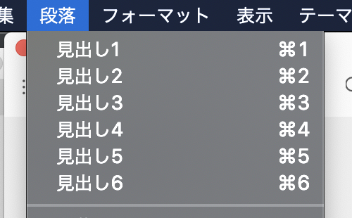

# ヘッダー１

## ヘッダー２

### ヘッダー３

#### ヘッダー４

##### ヘッダー５

###### ヘッダー６


### フォーマット

文字自体の表示を変更することができます。

| 機能           | Win/Linuxキー | MacOSキー |
| :------------- | :------------ | :-------- |
| 太字表現       | Ctrl + B      | Cmd + B   |
| 強調表現       | Ctrl + I      | Cmd + I   |
| 下線           | Ctrl + U      | Cmd + U   |
| ハイパーリンク | Ctrl + K      | Cmd + K   |

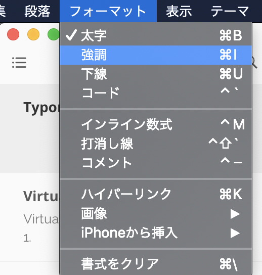

- **太字表現**
- *強調表現*
- <u>下線あり</u>
- ~~打ち消し線~~ 
- [ハイパーリンク](https://www.google.co.jp)

以下に関しては「設定」>「Markdown」>「文法サポート」で有効にした場合、反映されます。(反映するためには文書をreopenする必要)

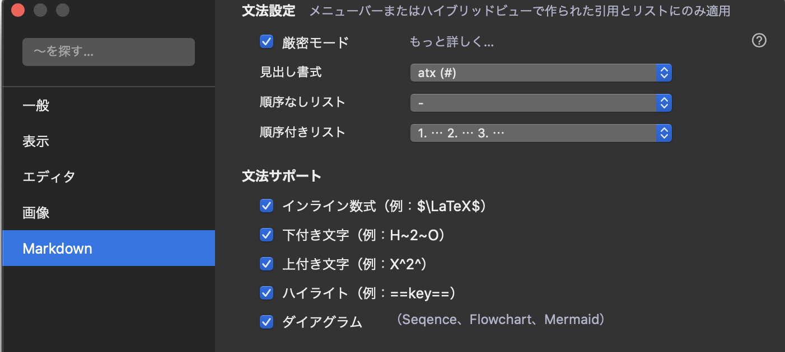

###  

インライン数式

| 機能             | Win/Linuxキー    | MacOSキー        |
| :--------------- | :--------------- | :--------------- |
| 数学ブロック挿入 | Ctrl + Shift + M | Cmd + Option + B |

$$
\ce{CH4 + 2 $\left( \ce{O2 + 79/21 N2} \right)$}
$$

下付き文字

$$H~2~O$$

上付き文字

X^2^

### コードブロック

記事内に[ ``` ]と記入することで**コードブロック**を挿入することが可能です。また、先頭の記号の後に言語名を入れることで、（その言語がサポートされていれば）シンタックスハイライトが適用されます。

[サポートする言語](https://support.typora.io/Code-Fences-Language-Support/)

| 機能       | Win/Linuxキー    | MacOSキー        |
| :--------- | :--------------- | :--------------- |
| コード挿入 | Ctrl + Shift + K | Cmd + Option + C |

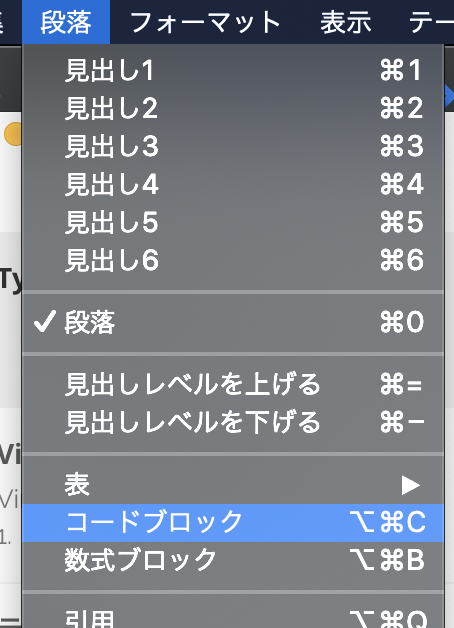

```python
def bubble_sort(nums):
    # We set swapped to True so the loop looks runs at least once
    swapped = True
    while swapped:
        swapped = False
        for i in range(len(nums) - 1):
            if nums[i] > nums[i + 1]:
                # Swap the elements
                nums[i], nums[i + 1] = nums[i + 1], nums[i]
                # Set the flag to True so we'll loop again
                swapped = True

# Verify it works
random_list_of_nums = [5, 2, 1, 8, 4]
bubble_sort(random_list_of_nums)
print(random_list_of_nums)
```


### 引用

「>」文字を先頭につけることで**引用ブロック**が作成されます。

> これが引用ブロックです。


### リスト

| 機能           | Win/Linuxキー    | MacOSキー        |
| :------------- | :--------------- | :--------------- |
| 順不同リスト   | Ctrl + Shift + ] | Cmd + Option + U |
| 順序付きリスト | Ctrl + Shift + [ | Cmd + Option + O |
| タスクリスト   | なし？           | Cmd + Option X   |
| インデント     | Tab              | Tab              |
| アウトデント   | Shift + Tab      | Shift + Tab      |

[ - ]又は[ * ]を文の先頭につけることで**通常のリスト**が作れます。

- リンゴ

- バナナ
  - フィリピンバナナ
  - 日本バナナ
- ナシ

また、[1.]を文の先頭につけることで**順序付きリスト**を作成できます。

1. バス
2. 飛行機
   1. 国際線
   2. 国内線
3. 車
4. 電車

[ - [ ] ]と記述することで**タスクリスト**も作ることができます。[x]とすることでチェック付きの表示となります。

- [ ] タスク

- [x] 完了タスク


### テーブルの作成

列と行を指定してテーブルを作成することができます。作成したテーブルはTypora上でテーブル編集時に表示されるツールチップを使う事で簡単にリサイズを変更する事ができます。

| 機能                 | Win/Linuxキー            | MacOSキー               |
| :------------------- | :----------------------- | :---------------------- |
| テーブル作成         | Ctrl + T                 | Cmd + Option + T        |
| 行の選択             | Ctrl + L                 | Cmd + L                 |
| 現在のセル内を選択   | Ctrl + E                 | Cmd + E                 |
| 行の追加(行末で行う) | Ctrl + Enter             | Cmd + Enter             |
| 行の削除             | Ctrl + Shift + Backspace | Cmd + Shift + Backspace |

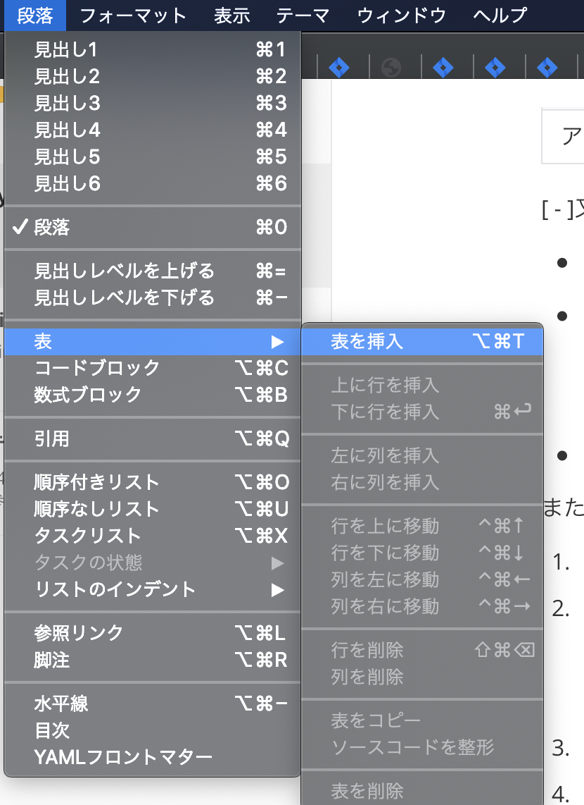

| ID   | 名前   | 組       |
| ---- | ------ | -------- |
| 001  | 桃太郎 | もも     |
| 002  | 花子   | すずらん |
| 003  | 田中   | ひまわり |

また、WYSIWYNG機能によって行/列の並び替えも簡単に行う事ができます。


### 脚注

[^xxx]と書くことで脚注をつける事ができます。脚注内容は脚注にカーソルを合わせると脚注内容が表示されます。

**栄光の架橋**[^ゆず]


脚注の内容は下記で定義

[^ゆず]: 1996年3月結成。横浜・伊勢佐木町での路上ライブからスタートし、現在も第一線で活動中！


### 水平線の追加

[ *** ]か[ --- ]を入力してEnterを押下する事で水平線が描画されます。

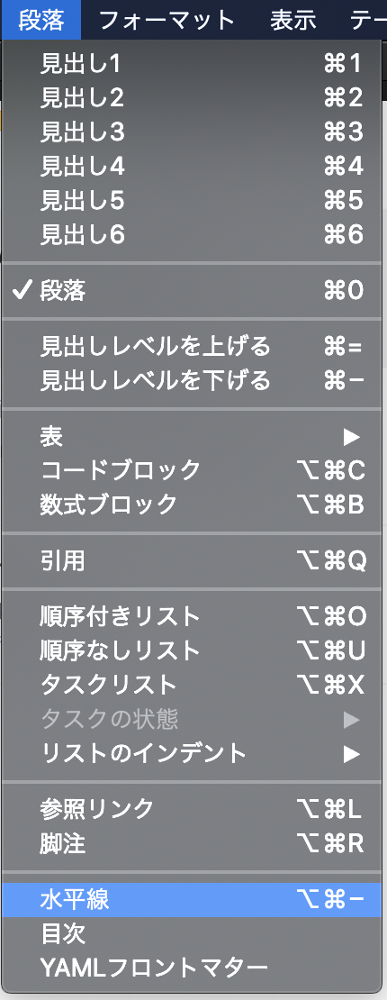

***

---


### 目次の追加

**[toc]**と入力してEnterを押下する事で目次が追加されます。

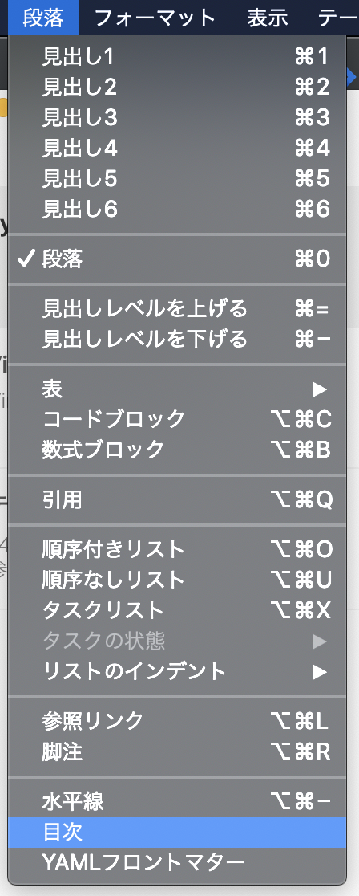

[toc]


### 図の作成

コードブロックにて[ sequence ]を指定して記述する事で**シーケンス図**が作れます。

```sequence
Alice->Bob: Hello Bob, how are you?
Note right of Bob: Bob thinks
Bob-->Alice: I am good thanks!
```

コードブロックにて[ flow ]を指定して記述する事で**フローチャート**を作ることも可能です。

```flow
st=>start: Start
op=>operation: Your Operation
cond=>condition: Yes or No?
e=>end

st->op->cond
cond(yes)->e
cond(no)->op
```

[Mermaid方式の図もサポートします](https://mermaid-js.github.io/mermaid/#/?id=about-mermaid)

#### シーケンス図

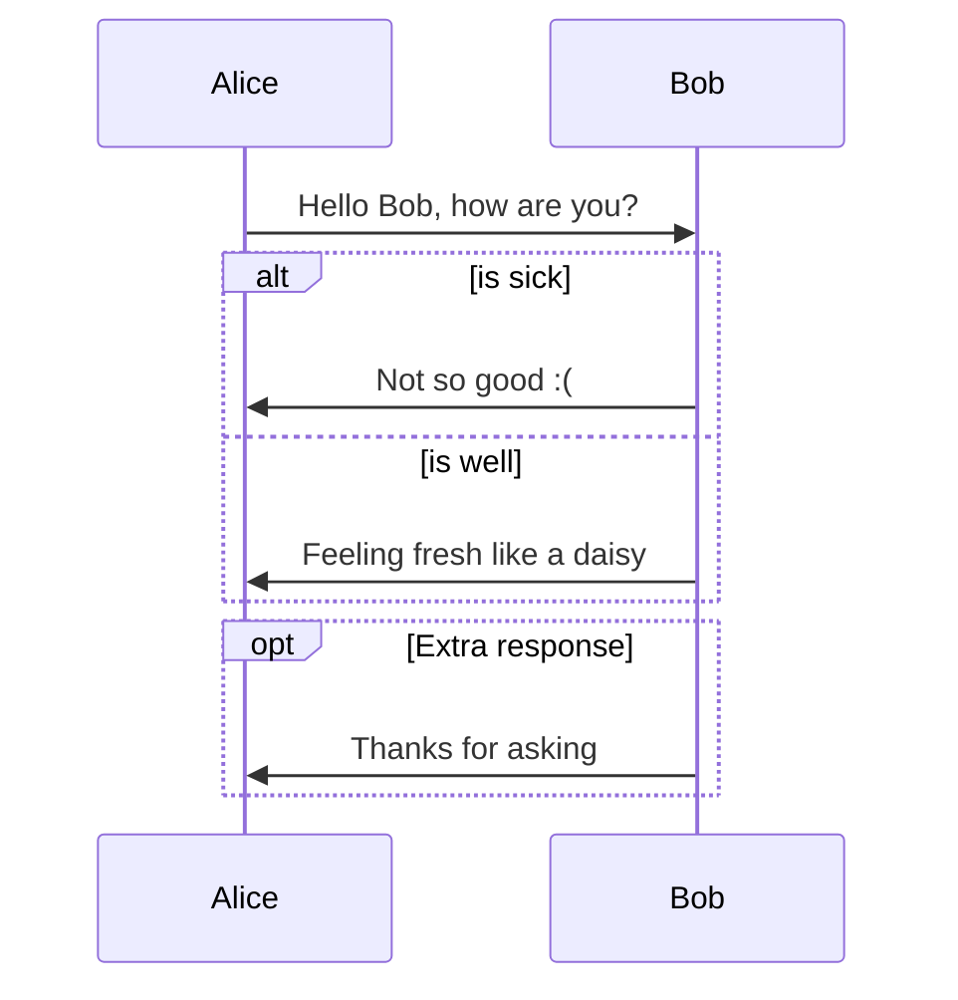

#### Flowcharts

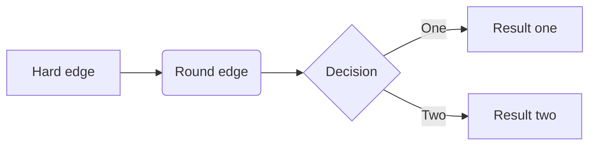

#### Gantt Charts

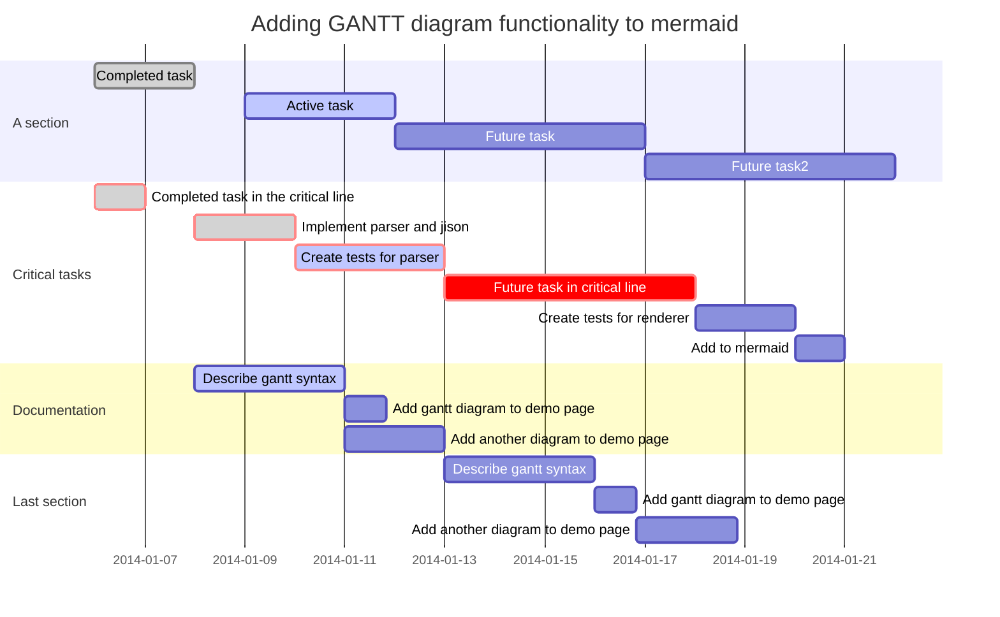

#### Class Diagrams

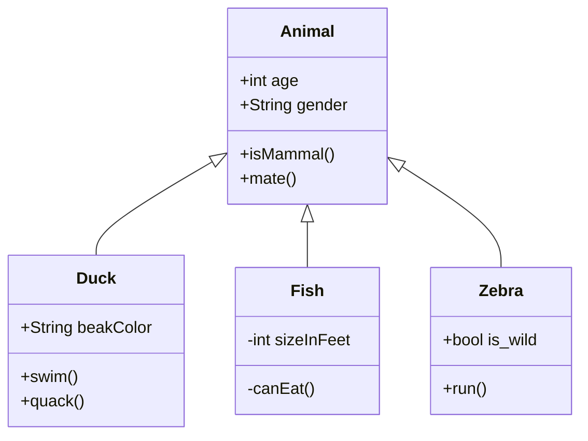

#### State Diagrams

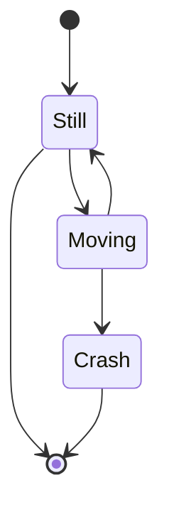

#### Pie Charts

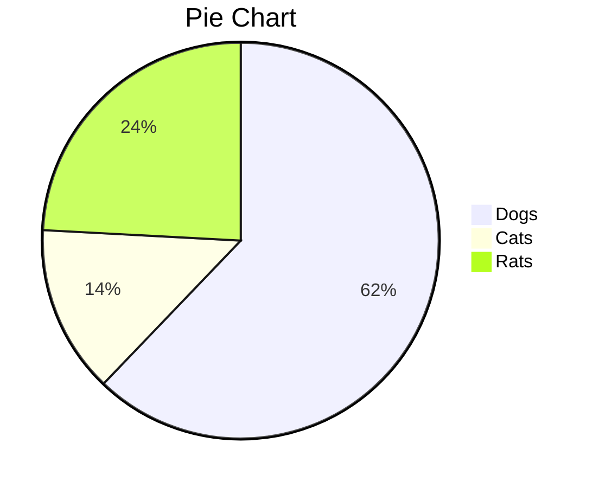


### Inline HTML

<span style='color:red'>This is red</span>

<ruby> 漢 <rt> ㄏㄢˋ </rt> </ruby>

<kbd>Ctrl</kbd>+<kbd>F9</kbd>

<span style="font-size:2rem; background:yellow;">**Bigger**</span>

HTML entities like &reg; &#182;

### Embed Web Contents

<iframe height='265' scrolling='no' title='Fancy Animated SVG Menu' src='//codepen.io/jeangontijo/embed/OxVywj/?height=265&theme-id=0&default-tab=css,result&embed-version=2' frameborder='no' allowtransparency='true' allowfullscreen='true' style='width: 100%;'>See the Pen <a href='https://codepen.io/jeangontijo/pen/OxVywj/'>Fancy Animated SVG Menu</a> by Jean Gontijo (<a href='https://codepen.io/jeangontijo'>@jeangontijo</a>) on <a href='https://codepen.io'>CodePen</a>. </iframe>

